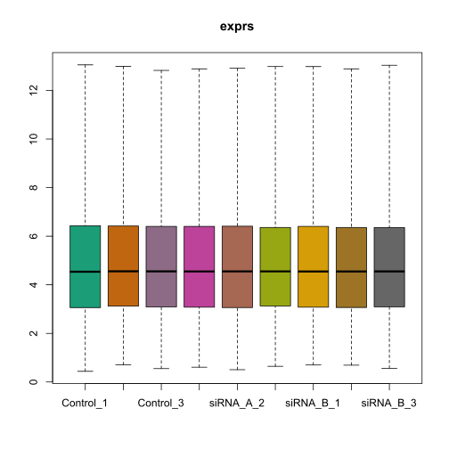

# BME2063 HW2 Report

**潘修齐 2018522077**

[toc]

## Quick Answers

* gene B have larger effect than gene A
* gene A and B are possible suppressor for Ras/MAPK pathway, whose cascading effects may cause uncontrolled cell proliferation.

## Results

### Raw data QC

The data is obtained using **Affymetrix Human gene 2.0 st** array. The data QC and pre-preprocessing is done using package oligo[1]. To visualize and assess the quality of array, MA plot and box plot are performed. As is shown in the figure, the data is in relatively high quality.


### Normalization

The raw microarray data is normalized using RMA (Robust Multichip Average) algorithm. The normalization result is proven reasonable by another box plot and MA plot afterwards. The probe annotations are also done using oligo.




Also, no clear batch effect was observed by a MDS plot.


To reproduce, run the bash:

```shell
Rscript /script/1-oligo_process.R
```

### Gene Set Enrichment Analysis (GSEA)

After RMA normalization, the normalized expression data was output as a tab-delimited text file and then converted manually into gct format using excel (as is recommended in gene pattern website [2]). Gene set enrichment analysis is then performed by GSEA maintained by Broad Institute[3]. The gene expression data was measured under a oncogene and pathways specialized gene set (`/resources/c6.all.v7.1.symbols.gmt`) and annotated by array specific annotation file provided by MSigDB (`/resources/Human_AFFY_HuGene_2_0_st_v1_MSigDB.v7.1`). The parameters are listed as follows:

| parameter                      | value     |
| ------------------------------ | --------- |
| number of permutations         | 1000      |
| collapse remap to gene symbols | Collapse  |
| permutation type               | phenotype |

The result can be found on `/FinalReport/result/GSEA`. To further understand the GSEA result, a python jupyter notebook was written. Since it is the same pathway affected by the inhibition of gene A and B, we focus on the intersection of enriched gene set between the two samples. By observing the distribution of Normalized Enrichment Score (NES) and False Discovery Rate (FDR) q-value, a threshold of $ NES > 4$ and $ FDR q-value < 0.3 $ is chosen. The NES and FDR q-value distribution is as follows: 


After filtering the gene sets, 11 gene sets were observed to be significantly enriched in both conditions, they are listed below together with a brief introduction:

| gene set                      | description                                                  |
| ----------------------------- | ------------------------------------------------------------ |
| BMI1_DN_MEL18_DN.V1_DN        | Genes down-regulated in DAOY cells (medulloblastoma) upon knockdown of BMI1 and PCGF2 genes by RNAi. |
| EGFR_UP.V1_DN                 | Genes down-regulated in MCF-7 cells (breast cancer) positive for ESR1 and engineered to express ligand-activatable EGFR . |
| EIF4E_DN                      | Genes down-regulated in HMEC cells (primary mammary epithelium) upon over-expression of EIF4E gene. |
| ESC_V6.5_UP_LATE.V1_UP        | Genes up-regulated during late stages of differentiation of embryoid bodies from V6.5 embryonic stem cells. |
| KRAS.300_UP.V1_DN             | Genes down-regulated in four lineages of epithelial cell lines over-expressing an oncogenic form of KRAS gene. |
| KRAS.600.LUNG.BREAST_UP.V1_DN | Genes down-regulated in epithelial lung and breast cancer cell lines over-expressing an oncogenic form of KRAS gene. |
| KRAS.600_UP.V1_DN             | Genes down-regulated in four lineages of epithelial cell lines over-expressing an oncogenic form of KRAS |
| MYC_UP.V1_DN                  | Genes down-regulated in primary epithelial breast cancer cell culture over-expressing MYC |
| SNF5_DN.V1_DN                 | Genes down-regulated in MEF cells (embryonic fibroblasts) with knockout of SNF5 |
| TBK1.DN.48HRS_UP              | up-regulated in epithelial lung cancer cell lines upon over-expression of an oncogenic form of KRAS gene and knockdown of TBK1 |
| YAP1_UP                       | Genes up-regulated in MCF10A cells (breast cancer) over-expressing YAP1 gene. |

Among the 11 gene sets, 4 are directly involved in the `MAPK/ERK` pathway (also called `Ras-Raf-MEK-ERK ` pathway) and 2 are downstream regulated by `MAPK/ERK` pathway. Previous reports have shown that `MAPK/ERK` pathway has an important role in oncogenesis[4], making it very possible that gene A and B produce cancer through such pathway.

To regenerate that process, use `/resources/Controal_vs_ClassB.cls` (forgive me for spelling mistake) and `/resources/Control_vs_ClassA.cls` to run GSEA. The downstream analysis can be done by running notebook `script/2-GSEA_downstream.ipynb`

### Differential Expression Analysis

Differential Expression Analysis is done using R package `limma`. To evaluate differential expression level, a Bayesian model was used. The summary of differential expression result is as follows.

| type   | Control-A | Control-B |
| ------ | --------- | --------- |
| Down   | 727       | 3324      |
| No Sig | 52082     | 46663     |
| UP     | 808       | 3630      |


By viewing the Venn plot, we can immediately know the impact of inhibiting gene B is much bigger than that of gene A.

To dig deeper into the problem, a jupyter notebook is written to find the so-called gene A and B. By looking for highly differentially expressed gene in set A and set B, we found several genes. However, none of them have been reported to be related to the pathway found by GSEA. I decide not to expand the search space for the searching is way too time-consuming.


## References

1. https://www.bioconductor.org/packages/release/bioc/html/oligo.html
2. https://www.genepattern.org/file-formats-guide#_Creating_Input_Files_GCT
3. https://www.gsea-msigdb.org/gsea/index.jsp
4. https://www.nature.com/articles/1210421